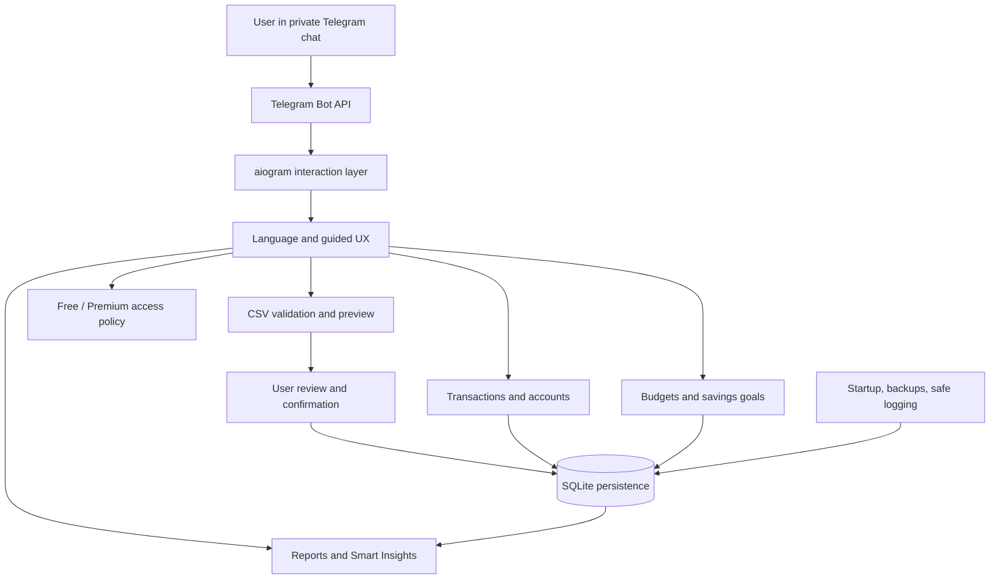

# High-level architecture

SmartSave is a Python Telegram application with single-process SQLite persistence. The diagram describes responsibilities without exposing private implementation details.

## Component responsibilities

- **Interaction and presentation:** commands, callbacks, confirmations, guided screens, saved language preference, localized UI.
- **Finance:** records, categories, accounts, transfers, budgets, goals, recurring costs.
- **Import:** supported CSV validation, temporary preview, review, duplicate protection, confirmed persistence.
- **Analysis:** read-only summaries, comparisons, trends, forecasts, insights.
- **Product access:** Free/Premium policies and entitlement/payment lifecycle infrastructure.
- **Operations:** configuration, startup validation, migrations, instance controls, backups, redacted errors.

## Data boundaries

The private application associates actions with authenticated Telegram senders and checks ownership. Review separates CSV preview from persistence. A dedicated synthetic demo workflow is documented separately from production data.

Telegram transports interactions and uploaded documents. Analytical calculations run locally without a mandatory external AI service; the overall interaction is not offline.

Credentials, actual databases, exports, operational paths, deployment configuration, private schemas, thresholds, and business rules are omitted.

## Deployment scope

One Python process, SQLite, and Linux/systemd packaging are documented. This repository contains no deployable application or private installation configuration. Multi-node operation, live deployment, and real payment verification are outside the demonstrated scope.
